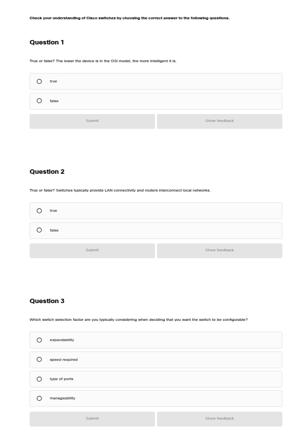

# CrewHive — WhatsApp Simulator Testing Guide

## Prerequisites

Make sure the dev server is running:

```bash
npm run dev
```

App runs at **http://localhost:3000**

---

## Step 1 — Log in with your Firebase test number

1. Go to **http://localhost:3000/auth/phone**
2. Enter your test phone number (without the `+` prefix, e.g. `917000000000` for `+91 7000000000`)
3. Click **Send OTP**
4. You'll be redirected to the OTP page automatically

---

## Step 2 — Verify OTP

1. Go to **http://localhost:3000/auth/verify-otp**
2. Enter **`123456`** (the test verification code you set in Firebase console)
3. Click **Verify**
4. You'll be redirected to role selection

---

## Step 3 — Skip role selection (go direct to simulator)

After login the app may redirect to `/auth/role-selection`.  
**Ignore that for simulator testing** — just navigate directly to:

```
http://localhost:3000/dev/simulator
```

---

## Step 4 — Use the WhatsApp Simulator

The simulator is a mobile WhatsApp-style UI (max-width 400px) tied to your logged-in Firebase UID.

### How it works

| You type | Bot does |
|---|---|
| *(page loads)* | Sends welcome message + asks for role |
| `crew` or `1` | Starts crew onboarding |
| `organizer` or `2` | Starts organizer onboarding |
| `restart` | Resets your session completely |

---

## Crew Onboarding Flow (full conversation)

```
Bot:  Welcome! Select role → crew or organizer
You:  crew

Bot:  What is your full name?
You:  Rahul Menon

Bot:  Which city? (1=Kochi, 2=Trivandrum, 3=Kozhikode, 4=Other)
You:  1

Bot:  What is your primary role? (1–10 list)
You:  1   ← or type: Sound Engineer

Bot:  Years of experience? (1=0-2, 2=3-5, 3=5-10, 4=10+)
You:  2

Bot:  Confirm your phone number (e.g. +91XXXXXXXXXX)
You:  +917000000000

Bot:  🎉 Registration complete! Profile saved → status: pending
```

---

## Organizer Onboarding Flow

```
Bot:  Welcome! Select role → crew or organizer
You:  organizer

Bot:  What is your full name?
You:  Arun Kumar

Bot:  What is your company name?
You:  AK Productions

Bot:  Which city is your company in?
You:  Kochi

Bot:  Describe your hiring requirements
You:  Need sound engineers and lighting crew for weddings

Bot:  🎉 Registration complete! Organizer profile saved
```

---

## Step 5 — Verify data saved in Firebase

Open your Firebase console → Firestore Database:

- **`users/{uid}`** — stores current step, role, and raw data
- **`crew/{uid}`** — created after crew completes onboarding (`status: pending`)
- **`organizers/{uid}`** — created after organizer completes onboarding

---

## Step 6 — Admin approves crew

1. Log in with your admin account
2. Go to **http://localhost:3000/admin/approvals**
3. You'll see the crew profile with status `pending`
4. Click **Approve**
5. Crew's status instantly becomes `approved` in Firestore (real-time, no refresh needed)

---

## Step 7 — Organizer searches and books crew

1. Log in as organizer → **http://localhost:3000/organizer/search**
2. Approved crew appear instantly (live via Firestore `onSnapshot`)
3. Click a crew card → **http://localhost:3000/organizer/crew/[id]**
4. Fill the booking form → Submit
5. Crew's simulator session is updated to `booking_response` step

---

## Step 8 — Crew responds to booking (in simulator)

After organizer sends a booking, the crew member's simulator will show:

```
Bot:  🔔 New Job Request!
      From: Arun Kumar
      Details: Date: 2026-04-10 | Location: Kochi

      Are you available?
      Reply YES to accept / NO to decline

You:  yes

Bot:  ✅ Booking Accepted! Availability set to unavailable.
```

Booking status in Firestore updates to `accepted` instantly.

---

## Quick Reference — All Simulator Commands

| Command | Effect |
|---|---|
| `crew` / `1` | Start crew onboarding |
| `organizer` / `2` | Start organizer onboarding |
| `yes` / `y` | Accept a booking request |
| `no` / `n` | Decline a booking request |
| `restart` | Reset session to beginning |
| `hi` / `hello` | Resume from current step |

---

## Simulator URL

```
http://localhost:3000/dev/simulator
```

---

## When real WhatsApp credentials are added

1. Add to `.env`:
   ```
   WHATSAPP_PHONE_NUMBER_ID=<your_id>
   WHATSAPP_ACCESS_TOKEN=<your_token>
   ```
2. Update the `sendMessage()` body in `lib/whatsapp.js` with the actual `fetch()` call
3. **No other changes needed** — the conversation engine and router stay the same
